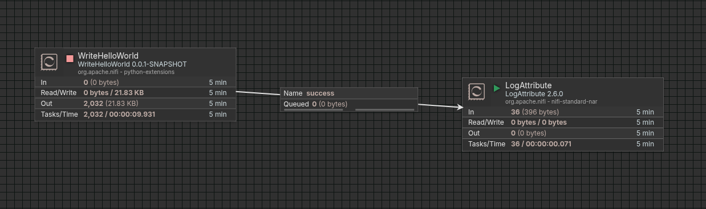

# Apache nifi python example nar

This is a sample project demonstrating how to build a Python extension that can be executed together with its dependencies.

The project is modeled after the Apache NiFi Python developer guide for FlowFile transforms and examples from the Apache NiFi repository:

- NiFi Python developer guide (FlowFile transform): https://nifi.apache.org/nifi-docs/python-developer-guide.html#flowfile-transform
- Apache NiFi on GitHub: https://github.com/apache/nifi

Purpose

- Show the structure of a Python extension that includes its dependencies (for example wheels or a requirements file).
- Demonstrate the basic idea of packaging and running code with its dependencies in the context of integration with systems such as Apache NiFi.

Running the example

1) Build the NAR (create a NiFi extension archive)

- Run: ./build_nar.sh

  What the script does (step-by-step):

  - Clears the working directory and recreates ./python_processor/tmp to start from a clean state.
  - Creates a MANIFEST.MF file under ./python_processor/tmp/META-INF that includes NiFi dependency metadata and build information (Nar-Id/Group/Version, Nifi-Dependency-*, Build-Tag/Timestamp/Revision/Branch, Built-By, Created-By).
  - Creates the directory ./python_processor/tmp/NAR-INF/bundled-dependencies which will hold all Python dependency packages.
  - Runs a Docker container using the Apache NiFi image (apache/nifi:2.6.0) and executes pip install inside that container to install packages from python_processor/requirements.txt into the bundled-dependencies directory. This ensures dependencies are installed with a runtime compatible with NiFi.
    - The command mounts your project python_processor folder into the container so the target path (/python_processor/tmp/NAR-INF/bundled-dependencies) is populated on the host.
  - Copies all Python files (python_processor/*.py) into the tmp working directory so they become part of the extension.
  - Packs the contents of ./python_processor/tmp into a NAR file at nifi-data/nar_extensions/my-python.nar (removing any previous my-python.nar first).

  Result: a NAR archive (nifi-data/nar_extensions/my-python.nar) that contains the MANIFEST.MF, the bundled Python dependencies and your Python source files. This NAR can be deployed to NiFi's nar_extensions directory.

2) Start the NiFi environment

- Run (from the repository root, assuming docker-compose.yml is present and configured):

  docker-compose up -d

- This will start the services in detached mode. NiFi is typically available at https://localhost:8443/nifi/ after the containers are up.
- If NiFi uses a self-signed certificate, your browser will warn about the certificate — accept/allow it for the local demo.

3) Open NiFi UI

- Open: https://localhost:8443/nifi/
- Login with the demo credentials:
  - Username: admin
  - Password: admin1234567890

4) Prepare an example flow (high-level)

- Example screenshot of a minimal flow:

  

Notes and warnings

- Adjust paths, NiFi version, and docker-compose configuration to your local environment.
- The build script assumes git is available for Build-Revision/Branch values and that the apache/nifi Docker image is reachable.
- It's recommended to use the same Python version as the NiFi runtime when building the NAR (for example, by running pip inside the NiFi Docker image as the script does). If you build dependencies with a different Python version you may get binary incompatibilities or missing wheels (especially for packages with native extensions), and pip may not be able to install all required dependencies into the bundled-dependencies folder.
- The example passwords and credentials are for local demo purposes only — do not use them in production.

Notes

- This repository is educational and demonstrative. It is not production-ready and should be adapted and tested for your target environment.
- The examples and structure are inspired by the NiFi documentation and NiFi GitHub examples; exact steps may vary depending on NiFi version and runtime details.
